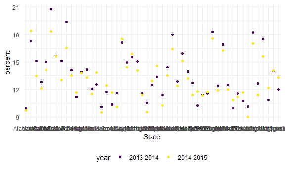
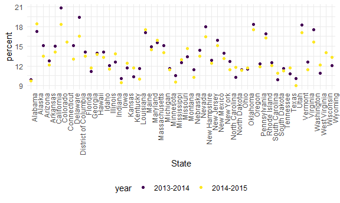
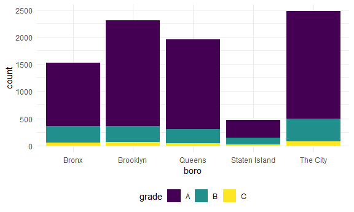
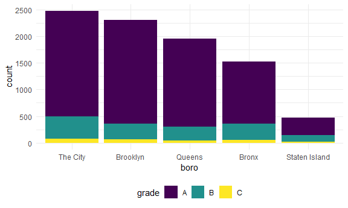

Data Wrangling II:Strings and Factors
================

``` r
library(tidyverse)
```

    ## -- Attaching packages --------------------------------------- tidyverse 1.3.1 --

    ## v ggplot2 3.3.5     v purrr   0.3.4
    ## v tibble  3.1.4     v dplyr   1.0.7
    ## v tidyr   1.1.3     v stringr 1.4.0
    ## v readr   2.0.1     v forcats 0.5.1

    ## -- Conflicts ------------------------------------------ tidyverse_conflicts() --
    ## x dplyr::filter() masks stats::filter()
    ## x dplyr::lag()    masks stats::lag()

``` r
library(rvest)
```

    ## 
    ## Attaching package: 'rvest'

    ## The following object is masked from 'package:readr':
    ## 
    ##     guess_encoding

``` r
library(httr)
library(p8105.datasets)


knitr::opts_chunk$set(
  fig.width = 6,
  fig.asp = .6,
  out.width = "90%"
)

theme_set(theme_minimal() + theme(legend.position = "bottom"))

options(
  ggplot2.continuous.colour = "viridis",
  ggplot2.continuous.fill = "viridis"
)

scale_colour_discrete = scale_colour_viridis_d
scale_fill_discrete = scale_fill_viridis_d
```

## String Vectors

``` r
string_vec = c("my", "name", "is", "jeff")

str_detect(string_vec, "m")
```

    ## [1]  TRUE  TRUE FALSE FALSE

``` r
str_detect(string_vec, "jeff")
```

    ## [1] FALSE FALSE FALSE  TRUE

``` r
str_detect(string_vec, "Jeff")
```

    ## [1] FALSE FALSE FALSE FALSE

Strings are case-sensitive!

``` r
str_replace(string_vec, "jeff", "Jeff")
```

    ## [1] "my"   "name" "is"   "Jeff"

``` r
str_replace(string_vec, "jeff", "")
```

    ## [1] "my"   "name" "is"   ""

``` r
string_vec = c(
  "i think we all rule for participating",
  "i think i have been caught",
  "i think this will be quite fun actually",
  "it will be fun, i think"
  )

str_detect(string_vec, "i think")
```

    ## [1] TRUE TRUE TRUE TRUE

``` r
str_detect(string_vec, "^i think")
```

    ## [1]  TRUE  TRUE  TRUE FALSE

``` r
# ^ for "starts with"

str_detect(string_vec, "i think$")
```

    ## [1] FALSE FALSE FALSE  TRUE

``` r
# $ for "ends with"
```

``` r
string_vec = c(
  "Y'all remember Pres. HW Bush?",
  "I saw a green bush",
  "BBQ and Bushwalking at Molonglo Gorge",
  "BUSH -- LIVE IN CONCERT!!"
  )

str_detect(string_vec, "bush")
```

    ## [1] FALSE  TRUE FALSE FALSE

``` r
str_detect(string_vec, "Bush")
```

    ## [1]  TRUE FALSE  TRUE FALSE

``` r
# For upper and lowercase:
str_detect(string_vec,"[Bb]ush")
```

    ## [1]  TRUE  TRUE  TRUE FALSE

``` r
string_vec = c(
  '7th inning stretch',
  '1st half soon to begin. Texas won the toss.',
  'she is 5 feet 4 inches tall',
  '3AM - cant sleep :('
  )

# Want a range of values?
str_detect(string_vec, "[0-9][a-zA-Z]")
```

    ## [1]  TRUE  TRUE FALSE  TRUE

The character . matches anything

``` r
string_vec = c(
  'Its 7:11 in the evening',
  'want to go to 7-11?',
  'my flight is AA711',
  'NetBios: scanning ip 203.167.114.66'
  )

str_detect(string_vec, "7.11")
```

    ## [1]  TRUE  TRUE FALSE  TRUE

R reads that as “7 \[anything\] 11”

``` r
string_vec = c(
  'The CI is [2, 5]',
  ':-]',
  ':-[',
  'I found the answer on pages [6-7]'
  )

#str_detect(string_vec, "[")
# This doesn't work! Because "[" a special character. 

str_detect(string_vec, "\\[")
```

    ## [1]  TRUE FALSE  TRUE  TRUE

``` r
#Need 2 \\ because \ is ALSO a special character
```

## Factors are weird

``` r
factor_vec = factor(c("male", "male", "female", "female"))

as.numeric(factor_vec)
```

    ## [1] 2 2 1 1

``` r
factor_vec = fct_relevel(factor_vec, "male")

as.numeric(factor_vec)
```

    ## [1] 1 1 2 2

## NSDUH

``` r
nsduh_url = "http://samhda.s3-us-gov-west-1.amazonaws.com/s3fs-public/field-uploads/2k15StateFiles/NSDUHsaeShortTermCHG2015.htm"

table_marj = 
  read_html(nsduh_url) %>% 
  html_table() %>% 
  first() %>%
  slice(-1)
```

This data is not tidy. Lets clean it.

``` r
marj_df = 
  table_marj %>% 
  select(-contains("P Value")) %>% 
  pivot_longer(
    -State,
    names_to = "age_year",
    values_to = "percent"
  ) %>% 
  separate(age_year, into = c("age", "year"), "\\(") %>%
  mutate(
    year = str_replace(year, "\\)", ""),
    percent = str_replace(percent, "[a-c]$", ""),
    percent = as.numeric(percent)
    ) %>% 
  filter(!State %in% c("Total U.S.", "Northeast", "Midwest", "South", "West"))
```

Do dataframe stuff

``` r
marj_df %>% 
  filter(age == "12-17") %>% 
  ggplot(aes(x = State, y = percent, color = year)) +
  geom_point()
```



``` r
marj_df %>% 
  filter(age == "12-17") %>% 
  ggplot(aes(x = State, y = percent, color = year)) +
  geom_point() +
  theme(axis.text.x = element_text(angle = 90, hjust = 1))
```



``` r
marj_df %>% 
  filter(age == "12-17") %>% 
  mutate(
    State = fct_reorder(State, percent)
  ) %>% 
  ggplot(aes(x = State, y = percent, color = year)) +
  geom_point() +
  theme(axis.text.x = element_text(angle = 90, hjust = 1))
```


## Restraunt Inspections

``` r
data("rest_inspec")
```

``` r
rest_inspec %>% 
  group_by(boro, grade) %>% 
  summarise(count = n())
```

    ## `summarise()` has grouped output by 'boro'. You can override using the `.groups` argument.

    ## # A tibble: 37 x 3
    ## # Groups:   boro [6]
    ##    boro     grade          count
    ##    <chr>    <chr>          <int>
    ##  1 BRONX    A              13688
    ##  2 BRONX    B               2801
    ##  3 BRONX    C                701
    ##  4 BRONX    Not Yet Graded   200
    ##  5 BRONX    P                163
    ##  6 BRONX    Z                351
    ##  7 BRONX    <NA>           16833
    ##  8 BROOKLYN A              37449
    ##  9 BROOKLYN B               6651
    ## 10 BROOKLYN C               1684
    ## # ... with 27 more rows

``` r
rest_inspec %>% 
  janitor::tabyl(boro, grade)
```

    ##           boro     A     B    C Not Yet Graded   P    Z   NA_
    ##          BRONX 13688  2801  701            200 163  351 16833
    ##       BROOKLYN 37449  6651 1684            702 416  977 51930
    ##      MANHATTAN 61608 10532 2689            765 508 1237 80615
    ##        Missing     4     0    0              0   0    0    13
    ##         QUEENS 35952  6492 1593            604 331  913 45816
    ##  STATEN ISLAND  5215   933  207             85  47  149  6730

``` r
rest_inspec =
rest_inspec %>% 
  filter(
    str_detect(grade, "[ABC]"),
    !(boro == "Missing")
  ) %>% 
  mutate(boro = str_to_title(boro))
```

Lets find the pizza places

``` r
rest_inspec %>% 
  filter(str_detect(dba, "Pizza")) %>% 
  janitor::tabyl(boro, grade)
```

    ##           boro  A B
    ##          Bronx  9 3
    ##       Brooklyn  6 0
    ##      Manhattan 26 8
    ##         Queens 17 0
    ##  Staten Island  5 0

``` r
#but this misses all the places titled "PIZZA" (most of them)

rest_inspec %>% 
  filter(str_detect(dba, "[Pp][Ii][Zz][Zz][Aa]")) %>% 
  janitor::tabyl(boro, grade)
```

    ##           boro    A   B  C
    ##          Bronx 1170 305 56
    ##       Brooklyn 1948 296 61
    ##      Manhattan 1983 420 76
    ##         Queens 1647 259 48
    ##  Staten Island  323 127 21

``` r
rest_inspec %>% 
  filter(str_detect(dba, "[Pp][Ii][Zz][Zz][Aa]")) %>%
  mutate(
    boro = fct_infreq(boro)
  ) %>% 
  ggplot(aes(x = boro, fill = grade)) + 
  geom_bar() 
```


What about changing a label?

``` r
rest_inspec %>% 
  filter(str_detect(dba, "[Pp][Ii][Zz][Zz][Aa]")) %>%
  mutate(
    boro = fct_infreq(boro),
    boro = str_replace(boro, "Manhattan", "The City")
  ) %>% 
  ggplot(aes(x = boro, fill = grade)) + 
  geom_bar() 
```



Messed up order!

``` r
rest_inspec %>% 
  filter(str_detect(dba, "[Pp][Ii][Zz][Zz][Aa]")) %>%
  mutate(
    boro = fct_infreq(boro),
    boro = fct_recode(boro, "The City" = "Manhattan")
  ) %>% 
  ggplot(aes(x = boro, fill = grade)) + 
  geom_bar() 
```



This worked!
